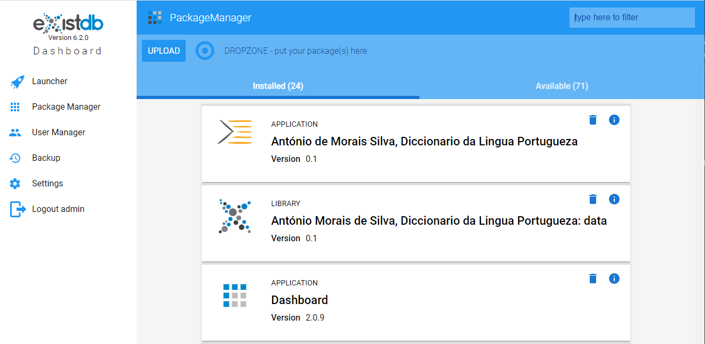
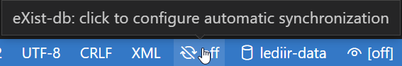
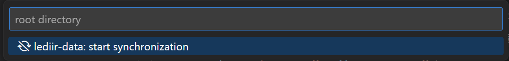

# MORDigital Web Application

TEI Publisher customization for  MORDigital project with dictionaries encoded according to the TEI Lex-0 standard.

This repository is aligned with TEI Publisher version 8.

## Installation

### Prerequsities

- [eXist-db](https://exist-db.org)  [eXist-db 6.2.0](https://github.com/eXist-db/exist/releases/tag/eXist-6.2.0) or [later](https://github.com/eXist-db/exist/releases/latest)

You can follow instruction from the [TEI Publisher](https://github.com/eeditiones/tei-publisher-app#installation) repository.

- [MORDigital Data module](https://github.com/daliboris/mordigital-data) version [0.1.0](https://github.com/daliboris/mordigital-data/releases/tag/v0.1.0) or [later](https://github.com/daliboris/mordigital-data/releases/latest)

A prebuilt version of the app can be downloaded from this [repository](/relases/latest) and installed.

### Installation with Package Manager

On your eXist-db instance, open the package manager in the dashboard and move downloaded **MORDigital Web Application** on the `DROPZONE - put your package(s) here.` text, or hit `Upload` button and select downloaded file from your local directory. This should automatically install dependencies such as the **TEI Publisher: Processing Model Libraries**.



After installing the **MORDigital Web Application** an eXist-db applicataion called *António Morais de Silva, Diccionario da Lingua Portugueza* will show in the *Package Manager*.

## Structure of the project

### Directories

- `modules`
  - XQuery modules, witch implements the functionality of the application
  - project specific features should be implemented in this directory (not subdirectories)
  - `lib`
    - modules responsible for redirecting function calls to the implementation (`api.xql`, `api-dba.xql`, `api-odd.xql`) and/or some base functionaly (`browse.xql`, `epub.xql`, `on-odd-changed.xql`, `pages.xql`, `util.xql`)
    - `api`
      - implementation of the core TEI Publisher APIs
- resources
  - CSS, fonts, translation, images, JavaScripts used in generated outputs (HTML pages, PDF)
  - `odd`
    - ODD documents used for description of the desired outputs; core implementation of the application is generated from these files
- `templates`
  - HTML files (with full web pages or fragments) with UI for the web application
    - files contain mix of the basic HTML elements and [webcomponents](https://github.com/eeditiones/tei-publisher-components) designed for TEI Publisher's applications

## How to contribute

For developmnet plaeas install and use following components:

- [Node.js](https://nodejs.org/en/download) for installing and running `npm` packages (see *webcomponents* later)

- fork of TEI Publisher's [webcomponents](https://github.com/daliboris/tei-publisher-components) with enhanced functionality
  - clone the repository
  - call `npm install` only the first time after cloning
  - run `npm start` to run local server with webcomponents
  - all webcomponents talk to an endpoint, which will either be a TEI Publisher instance or an application generated from TEI Publisher. Docs and demos in this repo currently expect the endpoint to be available on <http://localhost:8080/exist>.

- install [eXist-db](https://github.com/eXist-db/exist/releases/latest)
  - install additional packages using the eXist-db Package Manager
    - [TEI Publisher: Processing Model Libraries](https://github.com/eeditiones/tei-publisher-lib), minimal version 3.0.0
- use [Visual Studio Code](https://code.visualstudio.com/download) as a code editor
  - install [existdb-vscode](https://marketplace.visualstudio.com/items?itemName=eXist-db.existdb-vscode) extension
- clone this repository
- rename `.existdb.json-default` to `.existdb.json` and change values under `sync/server` and  `servers/localhost` nodes to reflect your local configuration and settings
  - under `sync` node
    - `sync/server`: name of the server which is defined under `servers` node (default value: `localhost`)
      - note: if you change the name here, do the same under `servers` node
    - `sync/ignore`: array of file names (can contain wildcards such as `*` and `?`) which shoudn't be synchronized with the eXist-db coolection
  - under `servers` node
    - `localhost`: name of the configuration consisting from the followed values (if you change name of the configuration here, you should change it also for the `sync/server` node, see above)
      - `server`: URL of the eXist-db server (default value: `http://localhost:8080/exist`)
      - `user`: name of the user with admin privileges (default value: `admin`)
      - `passowrd`: password of the user with admin privileges (default value: `""`, i.e. an empty string)
      - `root`: name of the eXist-db collection which contains TEI Lex-0 Publisher code (default value: `/db/apps/teilex0-publisher`)
- open cloned repository as a directory in **Visual Studio Code** and save it as a Workspace (file with `.code-workspace` extension will be created, this file shouldn't be synchronized to the GitHub repository as it's excluded in `.gitignore` file)
- start the the synchronization of your local folder with the collection in eXist-db from the status bar

    
    

  - if you run the synchronization the **first time**, `existdb-vscode` will inform you that an extension on the eXist-db should be installed, please confirm that you agree with the installation
  - note that files are synchronized **only in one way**: from your local repository to the eXist-db
    - if you change the code in eXist-db (for example in eXide editor, ODD editor or oXygen XML Editor) changes are not reflected in the local directory and can be overwritten if you change the code in the local directory
- change the code, test the application, send pull request to the main repository

## Static content in Jetty

For to serve/deliver static web content, for example images, create an `xml` configuration file in the Jetty repository.

If the eXist-db is installed in the `D:\exist-db` directory, the directory for the config file will be `D:\eXist-db\etc\jetty\webapps\`. The confuguration file can have any name, for example `mordigital-images.xml`.

Note the `PUBLIC` identifier for Jetty 9.4.50.v20221201, which is delivered with [eXist-db 6.2.0](https://exist-db.org/exist/apps/wiki/blogs/eXist/eXistdb620).

```xml
<!DOCTYPE Configure
  PUBLIC "-//Jetty//Configure//EN" "http://www.eclipse.org/jetty/configure_9_3.dtd">
<Configure class="org.eclipse.jetty.server.handler.ContextHandler">
 <Set name="contextPath">/mordigital</Set>
 <Set name="handler">
  <New class="org.eclipse.jetty.server.handler.ResourceHandler">
   <Set name="resourceBase">D:/MorDigital/local/data/images</Set>
   <Set name="directoriesListed">true</Set>
  </New>
 </Set>
</Configure>
```

More details can be found in the [Using Jetty to Serve Static Web Content](https://www.codeproject.com/Articles/1223459/Using-Jetty-to-Serve-Static-Web-Content) article by Han Bo Sun.
